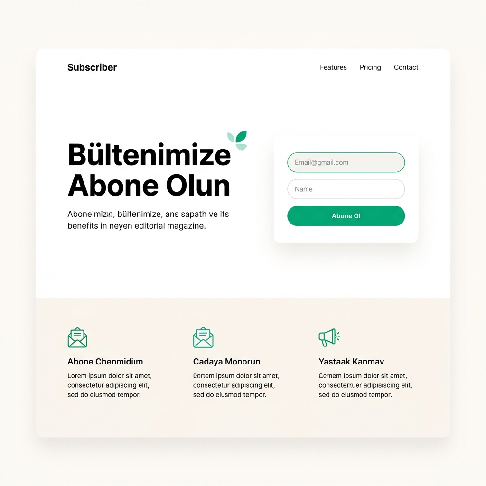

# Email Subscriber - Requirements Document

## 1. Proje Özeti

Email Subscriber, ziyaretçilerin e-posta abonelik formu üzerinden kaydolabildiği, kayıt sonrası otomatik hoş geldin/onay e-postası alabildiği ve site sahiplerinin abonelerine düzenli bülten/güncelleme gönderebildiği bir abonelik yönetim sistemidir.

Hedef kitle: bloglar, küçük işletmeler, e-ticaret siteleri ve kurumsal web siteleri.

> **Proje Kapsamı Notu:** Bu proje bir ödev/öğrenim projesi olarak geliştirilmektedir. Temel özellikleri sağlam ve doğru şekilde uygulamaya odaklanılmıştır. Aşırı mühendislik gerektiren konular (dağıtık mesaj kuyruğu, çoklu sunucu ölçeklendirme, büyük ölçekli SaaS altyapısı) kapsam dışıdır; ancak gerçek production pattern'ları öğrenim amacıyla uygulanmaktadır.

## 2. Teknoloji Yığını

| Katman | Teknoloji |
|---|---|
| Frontend | React (Vite veya Create React App) |
| Backend / API | .NET (ASP.NET Core Web API) |
| Veritabanı | MySQL |
| E-posta Gönderimi | SMTP üzerinden MailKit (.NET) |
| Stil / UI | Tailwind CSS |
| Animasyon | Framer Motion |
| Kimlik Doğrulama (admin paneli için) | JWT tabanlı authentication |
| ORM | Entity Framework Core |

> Not: Frontend/backend teknoloji tercihleri kullanıcı deneyimine göre React + .NET olarak belirlenmiştir. Tasarım kütüphanesi (Tailwind) varsayılan bir öneridir, değiştirilebilir.

## 3. Fonksiyonel Gereksinimler

### 3.1 Abonelik Formu
- Ziyaretçi, e-posta adresini girerek bültene abone olabilir.
- Form alanları: E-posta adresi (zorunlu), isim (opsiyonel).
- İstemci tarafında (React) ve sunucu tarafında (.NET API) e-posta format doğrulaması yapılır.
- Aynı e-posta adresi ile tekrar abone olma denemesi engellenir ve kullanıcıya bilgilendirici mesaj gösterilir.

### 3.2 Onay / Hoş Geldin E-postası
- Başarılı form gönderiminden sonra, kullanıcının e-postasına bir **onay linki** gönderilir (double opt-in - çift onay mekanizması).
- Kullanıcı bu linke tıklamadan abonelik kesin olarak aktifleşmez (`IsConfirmed = true` olana kadar).
- Onay linki oluşturulduğu andan itibaren **24 saat** geçerlidir. Süre dolduktan sonra link geçersiz sayılır ve kullanıcıdan yeni bir onay e-postası talep etmesi istenir.
- Onay linkine tıklandıktan sonra sistem otomatik olarak bir **hoş geldin e-postası** gönderir.
- E-posta içeriği HTML şablon olarak hazırlanır ve **kişiselleştirme** desteği içerir (ör. abone ismi varsa "Merhaba {İsim}," şeklinde e-postaya yerleştirilir; isim girilmemişse genel bir karşılama kullanılır).
- Onay ve hoş geldin e-postaları için ayrı ayrı HTML şablonlar tanımlanır (`ConfirmationEmailTemplate`, `WelcomeEmailTemplate`).

### 3.3 Abonelikten Çıkma (Unsubscribe)
- Her gönderilen e-postada bir "abonelikten çık" linki bulunur.
- Kullanıcı bu linke tıkladığında veritabanındaki kaydı pasif/silinmiş olarak işaretlenir.

### 3.4 SMTP Yapılandırması
- E-posta gönderimi için **Gmail SMTP** kullanılır (`smtp.gmail.com`, port 587, TLS).
- Gmail hesabında 2FA (iki adımlı doğrulama) açılarak bir **Uygulama Şifresi (App Password)** oluşturulur ve bu şifre SMTP kimlik doğrulamasında kullanılır.
- SMTP bilgileri (host, port, kullanıcı adı, uygulama şifresi) ortam değişkenleri (environment variables) veya `appsettings.json` + user secrets üzerinden güvenli şekilde yönetilir; koda gömülmez.
- E-posta gönderim mantığı soyutlanmış bir servis (`IEmailService`) arkasına gizlenir; böylece ileride farklı bir SMTP sağlayıcısına geçiş kolay olur.
- Gmail SMTP'nin ücretsiz günlük limiti (~500 e-posta/gün) bu projenin ihtiyaçlarını karşılar; dışarıdan ek bir servis gerekmez.

### 3.5 Hata Yönetimi
- Geçersiz e-posta formatı, mükerrer kayıt, SMTP bağlantı hatası gibi durumlarda kullanıcıya anlamlı hata mesajları gösterilir.
- Backend tarafında tüm hatalar loglanır (ör. Serilog).
- API, standart HTTP durum kodları (400, 409, 500 vb.) ile hata döner.

### 3.6 Admin Paneli
- Sistemde **tek bir standart admin hesabı** bulunur (çoklu kullanıcı/rol yönetimi bu sürümde yok).
- Yönetici, kullanıcı adı/şifre ile giriş yapar (JWT tabanlı authentication).
- Yönetici, abone listesini görüntüleyebilir, arayabilir/filtreleyebilir (aktif/pasif, onaylı/onaysız).
- Yönetici, tek tek aboneleri manuel olarak pasif hale getirebilir veya silebilir.
- Abone istatistikleri: toplam abone sayısı, aktif/pasif oranı.
- İlk sürümde sayfalama (pagination) zorunlu değildir; abone sayısı arttıkça kolayca eklenebilir yapıda olmalıdır.

### 3.7 Toplu Bülten Gönderimi (Newsletter)
- Yönetici, admin panelinden zengin metin editörü (rich text editor) ile bir bülten e-postası oluşturabilir.
- Bülten, tüm aktif ve onaylı abonelere gönderilir.
- Gönderim, **arka plan kuyruğu** (`IHostedService + Channel<T>`) aracılığıyla asenkron şekilde yapılır; yönetici butona bastığında API hemen `"gönderiliyor"` yanıtı döner, e-postalar arka planda sırayla iletilir.
- Her gönderilen bültende otomatik olarak abonelikten çıkma (unsubscribe) linki bulunur.
- Gönderim geçmişi (hangi bülten, ne zaman, kaç kişiye gönderildi) admin panelinde listelenir.

### 3.8 Basit Analitik (Open/Click Tracking)
- Her bültende, e-postanın açılıp açılmadığını tespit etmek için 1x1 piksel boyutunda görünmez bir **tracking pixel** (görüntü) kullanılır; bu görsel yüklendiğinde backend'e istek düşer ve "açıldı" olarak işaretlenir.
- Bülten içindeki linkler, tıklama sayısını ölçmek için backend üzerinden yönlendirme yapan bir **redirect endpoint**'e (`/api/track/click/{linkId}`) sarılır.
- Admin panelinde her bülten için basit metrikler gösterilir: gönderilen sayısı, açılma sayısı/oranı, tıklanma sayısı/oranı.
- Bu özellik "nice to have" niteliğindedir; temel abonelik/e-posta akışını etkilemez, ayrı bir modül olarak eklenir.

## 4. Fonksiyonel Olmayan Gereksinimler

### 4.1 Responsive Tasarım
- Abonelik formu ve tüm sayfalar mobil, tablet ve masaüstü ekranlarda tutarlı şekilde çalışmalıdır.
- Tailwind CSS'in responsive utility sınıfları (`sm:`, `md:`, `lg:`) kullanılarak breakpoint bazlı düzen sağlanır.

### 4.2 Performans
- Abonelik formu gönderimi 2 saniyeden kısa sürede yanıt vermelidir.
- SMTP gönderimi, kullanıcıyı bloklamayacak şekilde **`IHostedService + Channel<T>` tabanlı arka plan kuyruğu** üzerinden asenkron olarak işlenir:
  - İstek gelir → kuyruğa eklenir → API hemen `200 OK` döner → arka planda worker sırayla e-postayı gönderir.
  - Bu yaklaşım dışarıdan herhangi bir servis gerektirmez; ~30-40 satırlık bir sınıfla .NET built-in özellikleriyle uygulanır.
- **Retry Mekanizması:** Worker bir e-postayı göndermede başarısız olursa (SMTP hatası, timeout vb.) en fazla **3 kez** yeniden dener. 3 denemede de başarısız olunursa hata loglanır ve ilgili gönderim başarısız olarak işaretlenir; uygulama çökmez.

### 4.3 Güvenlik
- Girdi doğrulama ve sanitizasyon (SQL injection, XSS koruması).
- Rate limiting: aynı IP'den kısa sürede çoklu abonelik denemesi engellenir (spam/bot koruması).
- CAPTCHA veya honeypot alanı ile bot koruması (opsiyonel).
- HTTPS zorunluluğu.

### 4.4 Erişilebilirlik (Accessibility)
- Form elemanları uygun `label` ve `aria` etiketleriyle erişilebilir olmalıdır.

## 5. Mimari Genel Bakış

```
[React Frontend] --HTTP/REST--> [.NET Web API] --SQL--> [MySQL]
                                       |
                                       +---> [Channel<EmailJob>] ---> [IHostedService Worker]
                                                                              |
                                                                              +--SMTP--> [Gmail]
```

- Frontend, backend'e REST API üzerinden istek atar (JSON formatında).
- Backend, iş mantığını (validasyon, kayıt, e-posta tetikleme) yönetir.
- E-posta gönderimi, `Channel<T>` kuyruğuna yazılır; API isteği hemen döner.
- `IHostedService` tabanlı bir arka plan worker'ı kuyruğu dinler ve e-postaları sırayla gönderir.

## 6. Veritabanı Şeması (Taslak)

**Subscribers Tablosu**

| Alan | Tip | Açıklama |
|---|---|---|
| Id | INT (PK, Auto Increment) | Benzersiz kimlik |
| Email | VARCHAR(255), UNIQUE | Abone e-posta adresi |
| Name | VARCHAR(255), NULL | Opsiyonel isim |
| IsConfirmed | BOOLEAN | Double opt-in onay durumu |
| IsActive | BOOLEAN | Abonelik durumu (unsubscribe sonrası false) |
| SubscribedAt | DATETIME | Kayıt tarihi |
| UnsubscribedAt | DATETIME, NULL | Abonelikten çıkış tarihi |
| ConfirmationToken | VARCHAR(255), NULL | Double opt-in / unsubscribe token'ı |
| ConfirmationTokenExpiresAt | DATETIME, NULL | Token geçerlilik süresi (oluşturulma + 24 saat) |

## 7. API Endpoint Taslağı

| Method | Endpoint | Açıklama |
|---|---|---|
| POST | `/api/subscribers` | Yeni abonelik oluşturur |
| GET | `/api/subscribers/confirm/{token}` | Double opt-in onayı |
| GET | `/api/subscribers/unsubscribe/{token}` | Abonelikten çıkış |
| GET | `/api/admin/subscribers` | (Admin) Abone listesi |
| POST | `/api/admin/newsletter` | (Admin) Toplu e-posta gönderimi |
| GET | `/api/track/open/{campaignId}/{subscriberId}` | Bülten açılma takibi (1x1 tracking pixel) |
| GET | `/api/track/click/{linkId}` | Bülten link tıklama takibi + yönlendirme |

## 8. Arayüz (UI/UX) Gereksinimleri

### 8.1 Genel Prensipler ve Seçilen Tasarım Yönü

**Seçilen Stil: Clean Minimal**

Aşağıdaki referans görsel, projenin genel tasarım yönünü ve estetik hedefini göstermektedir:



- **Renk Paleti:** Beyaz / hafif off-white arka plan; zümrüt yeşil birincil renk (`#10b981`) ve teal aksanlar.
- **Tipografi:** Modern sans-serif (Inter veya Outfit önerilir); çok boşluk, editorial okunabilirlik.
- **Stil Karakteri:** Minimalist, güvenilir, profesyonel; gereksiz dekorasyon ve karmaplıklıktan kaçınılır.
- Tüm sayfalar (abonelik formu, onay sayfası, unsubscribe sayfası, admin paneli) responsive olmalı.
- Admin paneli de aynı renk paleti üzerinden tutarlı bir arayüz sunar (sol sidebar yeşil aksanlı, içerik alanı beyaz).

### 8.2 Abonelik Formu
- Sade, dikkat çekici bir form (email input + opsiyonel isim alanı + "Abone Ol" butonu).
- Form gönderiminde loading state gösterilir (buton disable + spinner animasyonu).
- Başarılı/başarısız durumlarda **animasyonlu toast/alert bileşeni** ile kullanıcı bilgilendirilir (ör. fade-in/slide-in geçişi).
- Input alanına odaklanıldığında (focus) yumuşak bir vurgulama animasyonu (border/glow transition).

### 8.3 Mikro Animasyonlar / Geçişler
- Sayfa/bileşen geçişlerinde yumuşak fade/slide animasyonları (Framer Motion veya CSS transitions ile).
- Butonlarda hover/active durumlarında hafif scale veya renk geçiş animasyonları.
- Onay sayfası ve unsubscribe sayfasında, işlem başarılı olduğunda görsel bir "başarı" animasyonu (ör. checkmark animasyonu).
- Admin panelindeki istatistik grafiklerinde veri yüklenirken animasyonlu geçiş (chart.js veya recharts animasyonları).
- Animasyonlar performansı olumsuz etkilemeyecek şekilde hafif ve amaca yönelik tutulur; abartıdan kaçınılır.

### 8.4 Admin Paneli Arayüzü
- Sol menü + üst bar içeren standart bir dashboard düzeni.
- Abone tablosu: arama, filtreleme (aktif/pasif, onaylı/onaysız), sayfalama (pagination).
- Bülten oluşturma ekranında zengin metin editörü (rich text editor) ve canlı önizleme.
- İstatistik kartları ve büyüme grafiği ana panelde öne çıkarılır.

## 9. Açık Sorular / Netleştirilmesi Gerekenler

- [ ] Proje bir hosting'e deploy edilecek mi (ör. Azure, bir VPS), yoksa sadece yerel (localhost) ortamda mı çalıştırılacak/teslim edilecek?
- [ ] Ödev teslimi kapsamında kaynak kod + kısa bir kullanım/kurulum dokümanı (README) da isteniyor mu?

## 10. Kapsam Dışı (Bu Sürüm İçin)

- Çoklu dil desteği (i18n).
- Gelişmiş segmentasyon / kullanıcı etiketleme sistemi.
- A/B testi desteği için e-posta kampanyaları.
- Birden fazla admin kullanıcısı için rol tabanlı yetkilendirme (RBAC) — tek admin hesabı yeterli.
- RabbitMQ, Kafka, Azure Service Bus gibi dışarıdan servis gerektiren dağıtık mesaj kuyruğu sistemleri.
- CSV dışa aktarma — istenirse kolayca eklenebilecek küçük bir özellik olarak daha sonraya bırakılmıştır.
